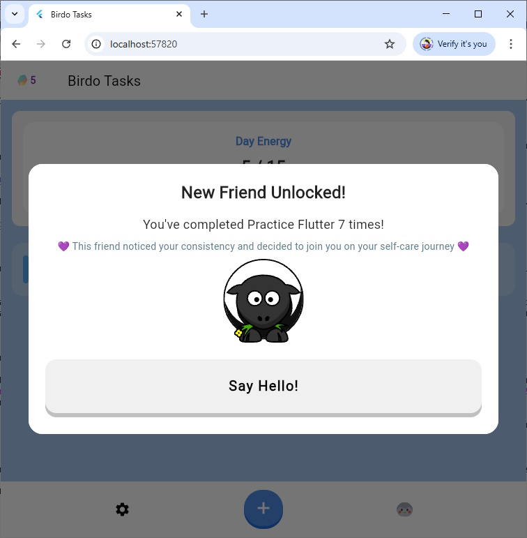

# Finch Software Engineer Take-Home
## Habit Formation App

**Submitted by:** Elli Amir
[el.ad.david.amir@gmail.com](mailto:el.ad.david.amir@gmail.com)
[LinkedIn Profile](https://www.linkedin.com/in/elli-el-ad-david-amir-68624b6/)

**Total Time Spent:** Approximately 6 hours, not including software installations.

### Project Description

1. **Recurring Tasks:** Add support for tasks that repeat daily or on specific weekdays.
2. **Habit Encouragement:** Encourage users to create recurring tasks to help support long-term habit formation.

> Note: For the purpose of this exercise, I focused on the Flutter codebase and did not make changes to the backend. If you'd like me to implement backend updates as well, I'd be happy to do so.

### Recurring Tasks

I implemented recurring tasks by extending the `Task` Hive object with two new fields:

- `isRecurring`: a boolean indicating whether the task should repeat.
- `recurringDays`: a list of weekday integers (e.g. `[1, 3, 5]` for Monday, Wednesday, Friday).

At the start of each day, the app iterates through all saved tasks. For every task marked as recurring, if the current weekday is listed in `recurringDays`, the app creates a new copy of that task and adds it to the current day's task list.

Each copied task includes a `parentId` field referencing the original recurring task that generated it. This prevents duplicate copies and associates all instances with their original task.

In addition, I introduced a `numCompleted` field on the original (parent) task. Whenever a recurring copy is completed, the app increments the `numCompleted` value on its parent. This enables the app to track the user’s long-term consistency across all instances of a recurring task.

#### UI

In the "Add Task" dialog, I added a "Repeat Task?" checkbox. When selected, a row of weekday buttons appears (Monday through Sunday), allowing the user to specify repeat days (similar to calendar apps). Once configured, the user can create the task as usual.

On the app home page, where the task list is presented, recurring tasks display a calendar icon and a formatted label indicating which days the task repeats.

#### Suggested Improvements

Given more time, I would extract a dedicated `RecurringTask` object to act as a template for generating recurring task instances. This would create a cleaner separation between recurring task definitions and their day-specific copies, simplifying both logic and data modeling. It would also provide a natural foundation for supporting additional recurrence patterns, such as monthly or custom schedules.

Additionally, the current implementation formats the repeat days using the `description` field within `TaskCard`. While convenient, this assumes that no custom description is present. A cleaner approach would be to pass the `recurringDays` directly to `ChunkyTaskCard` and have that widget render the repeat information independently.

### Habit Encouragement

I introduced several design choices to encourage users to opt into recurring tasks and to stick with them.

**Default opt-in:**  
The "Repeat Task?" checkbox is selected by default. Research shows that users tend to follow default settings (see [Johnson & Goldstein, 2003](https://www.science.org/doi/10.1126/science.1091721) and [Bellman et al., 2009](https://papers.ssrn.com/sol3/papers.cfm?abstract_id=1324803)). This simple change helps nudge users toward building habits without requiring extra effort.

**Soft encouragement when opting out:**  
If the user turns off the checkbox, the app displays a short motivational message explaining that repeating tasks is a great way to form long-term habits.

**Visual prominence for recurring tasks:**  
Recurring tasks are given more visual weight in the task list: they're slightly taller and include a label that shows the selected repeat days, reinforcing their importance and helping them stand out.

**Positive reinforcement:**  
Each time a recurring task is completed, a toast appears congratulating the user and showing how many times they’ve completed it so far.

**Habit milestone reward:**  
When a task is completed 7 times, the user unlocks a new friend! A cute sheep joins their self-care journey.

#### Suggested Improvements

There’s a wide range of ways this feature could evolve. My goal for this project was to build a proof of concept, demonstrating several directions the app could take. Here are a few ideas for future expansion:

- A dedicated screen or dialog showing how many times a recurring task has been completed, with breakdowns by day of the week or calendar view.
- Unlock in-game currency, customization items, or pet growth stages after completing a recurring task a certain number of times.
- Introduce more collectible friends, with an interface to view, track, and choose which one appears on the home screen.
- Visual indicators for daily or weekly streaks tied to recurring tasks.
- Suggest making a task recurring based on completion patterns ("you've done this 3 Mondays in a row, want to make this a recurring weekly task?").

---

Thank you for reviewing my take-home. I had a blast working on this project! Please let me know if you'd like me to expand it further or walk through any part of the implementation.

*-- Elli (they/them)*

